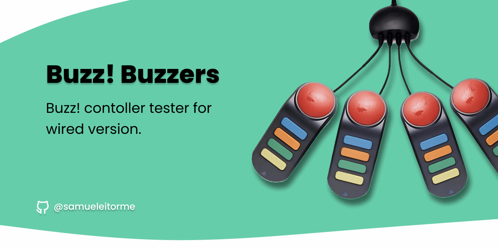
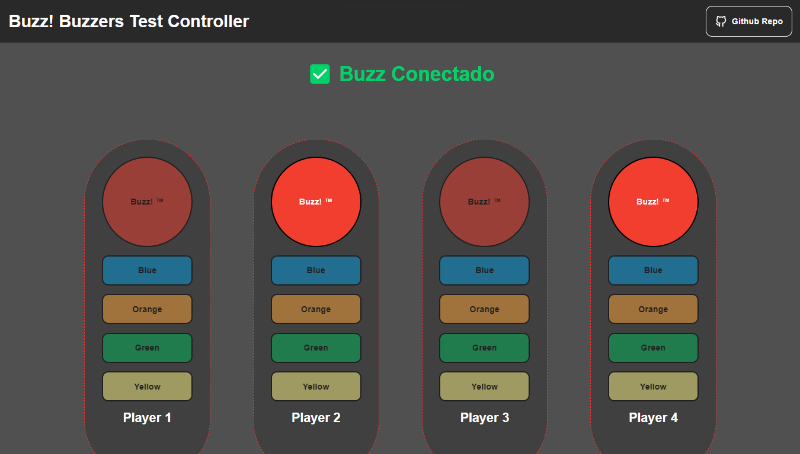
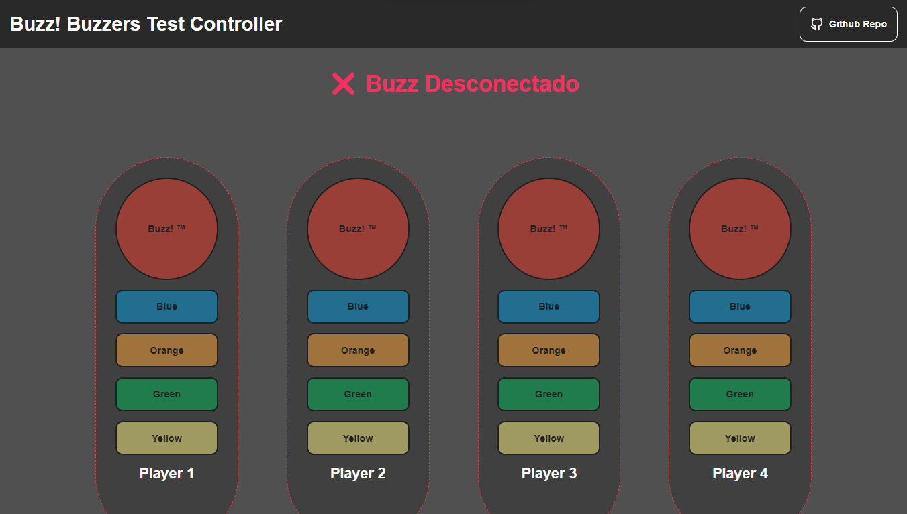

# Buzz Buzzers Test (en)

Buzz Buzzers Test is a simple tool to check the functionality of Buzz controllers using a USB connection. Buzz controllers are trivia and buzzer controllers used in interactive games. This project provides an easy and quick way to verify if the Buzz controllers are properly connected and functioning as expected.

[Leeme en español](README-EN.md)

## Requirements

- Computer with available USB ports.
- Buzz controller .

## How to use

1. Connect the Buzz controllers to a USB port on your computer.

2. Open the [Buzz Buzzers Test](https://samueleitorme.github.io/buzz-buzzers-test/) web page on your computer.

3. Press the buttons on the Buzz controllers to see if the application detects the button presses. The results will be displayed on the screen.

- If a Buzz controller button is pressed, and a visual indicator or message confirms detection, it means the controller is working correctly.

- If no reaction is displayed after pressing the controller buttons, there may be a connection or configuration issue.

## Screenshots

> Successful detectio of a Buzz controller.

> Detection after pressing the Buzz controller buttons.

## Notas

This project is just a diagnostic tool.

## Licencia

This project is under the [GPLv3](./LICENSE).
