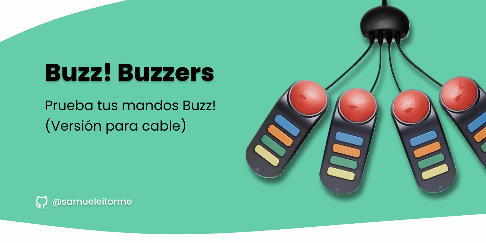

# Buzz Buzzers Test

Buzz Buzzers Test es una herramienta simple para comprobar el funcionamiento de los mandos de Buzz utilizando una conexión USB. 
Los mandos de Buzz son controladores de trivia y buzzer utilizados en juegos interactivos. 
Este proyecto proporciona una manera fácil y rápida de verificar si los mandos de Buzz están correctamente conectados y funcionando como se espera.

## Características

- **Comprobación rápida:** Buzz Buzzers Test permite verificar rápidamente si los mandos de Buzz están respondiendo correctamente.
  
- **Interfaz sencilla:** La interfaz de usuario minimalista hace que sea fácil entender los resultados de la prueba sin complicaciones innecesarias.

- **Indicadores visuales:** Los resultados de las pruebas se muestran con indicadores visuales claros, lo que facilita la interpretación incluso para usuarios no técnicos.

## Cómo usar

1. **Conexión de mandos:** Conecta los mandos de Buzz a un puerto USB de tu ordenador.

2. **Ejecución del programa:** Abre la web [Buzz Buzzers Test](https://samueleitorme.github.io/buzz-buzzers-test/) en tu ordenador.

3. **Realizar la prueba:** Presiona los botones en los mandos de Buzz para ver si la aplicación detecta las pulsaciones. Los resultados se mostrarán en la pantalla.

4. **Interpretación de resultados:**
   - Si un mando de Buzz es presionado y se muestra un indicador visual o un mensaje que confirma la detección, significa que el mando está funcionando correctamente.
   - Si no se muestra ninguna reacción después de presionar los botones del mando, podría haber un problema de conexión o configuración.

## Requisitos del sistema

- Ordenador con puertos USB disponibles.
- Mandos de Buzz conectados a través de USB.

## Capturas de pantalla

> Interfaz de usuario mostrando la detección exitosa de un mando de Buzz.

> Interfaz de usuario sin detección después de presionar los botones del mando de Buzz.

## Contribución

Las contribuciones son bienvenidas y pueden realizarse a través de solicitudes pull en este repositorio. Siéntete libre de mejorar la funcionalidad, el diseño o solucionar problemas.

## Notas

Este proyecto es solo una herramienta de diagnóstico y prueba.

## Licencia

Este proyecto está bajo la Licencia [GPLv3](./LICENSE).
